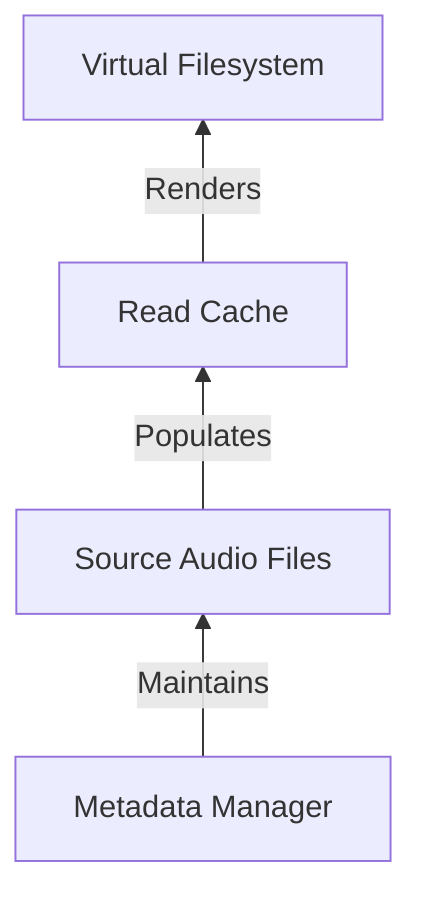

# Rosé

A virtual filesystem music library and a music metadata manager.

## The Virtual Filesystem Library

Rosé reads a source directory of albums like this:

```tree
.
├── BLACKPINK - 2016. SQUARE ONE
├── BLACKPINK - 2016. SQUARE TWO
├── LOOΠΔ - 2019. [X X]
├── LOOΠΔ - 2020. [#]
├── LOOΠΔ 1_3 - 2017. Love & Evil
├── LOOΠΔ ODD EYE CIRCLE - 2017. Max & Match
└── YUZION - 2019. Young Trapper
```

And constructs a virtual filesystem from the source directory's audio tags. The
virtual filesystem enables viewing various subcollections of the source
directory based on multiple types of tags as a filesystem.

While music players and music servers enable viewing releases with similar
filters, those filters are only available in a proprietary UI. Rosé provides
this filtering as a filesystem, which is easily composable with other tools and
systems.

The virtual filesystem constructed from the above source directory is:

```tree
.
├── albums
│   ├── BLACKPINK - 2016. SQUARE ONE - Single [K-Pop] {YG Entertainment}
│   ├── BLACKPINK - 2016. SQUARE TWO - Single [K-Pop] {YG Entertainment}
│   ├── LOOΠΔ 1_3 - 2017. Love & Evil [K-Pop] {BlockBerry Creative}
│   ├── LOOΠΔ - 2019. [X X] [K-Pop] {BlockBerry Creative}
│   ├── LOOΠΔ - 2020. [#] [K-Pop] {BlockBerry Creative}
│   ├── LOOΠΔ ODD EYE CIRCLE - 2017. Max & Match [K-Pop] {BlockBerry Creative}
│   └── YUZION - 2019. Young Trapper [Hip Hop] {No Label}
├── artists
│   ├── BLACKPINK
│   │   ├── BLACKPINK - 2016. SQUARE ONE - Single [K-Pop] {YG Entertainment}
│   │   └── BLACKPINK - 2016. SQUARE TWO - Single [K-Pop] {YG Entertainment}
│   ├── LOOΠΔ
│   │   ├── LOOΠΔ - 2019. [X X] [K-Pop] {BlockBerry Creative}
│   │   └── LOOΠΔ - 2020. [#] [K-Pop] {BlockBerry Creative}
│   ├── LOOΠΔ 1_3
│   │   └── LOOΠΔ 1_3 - 2017. Love & Evil [K-Pop] {BlockBerry Creative}
│   ├── LOOΠΔ ODD EYE CIRCLE
│   │   └── LOOΠΔ ODD EYE CIRCLE - 2017. Max & Match [K-Pop] {BlockBerry Creative}
│   └── YUZION
│       └── YUZION - 2019. Young Trapper [Hip Hop] {No Label}
├── genres
│   ├── Hip-Hop
│   │   └── YUZION - 2019. Young Trapper [Hip Hop] {No Label}
│   └── K-Pop
│       ├── BLACKPINK - 2016. SQUARE ONE - Single [K-Pop] {YG Entertainment}
│       ├── BLACKPINK - 2016. SQUARE TWO - Single [K-Pop] {YG Entertainment}
│       ├── LOOΠΔ 1_3 - 2017. Love & Evil [K-Pop] {BlockBerry Creative}
│       ├── LOOΠΔ - 2019. [X X] [K-Pop] {BlockBerry Creative}
│       ├── LOOΠΔ - 2020. [#] [K-Pop] {BlockBerry Creative}
│       └── LOOΠΔ ODD EYE CIRCLE - 2017. Max & Match [K-Pop] {BlockBerry Creative}
└── labels
    ├── BlockBerry Creative
    │   ├── LOOΠΔ 1_3 - 2017. Love & Evil [K-Pop] {BlockBerry Creative}
    │   ├── LOOΠΔ - 2019. [X X] [K-Pop] {BlockBerry Creative}
    │   ├── LOOΠΔ - 2021. [&] [K-Pop] {BlockBerry Creative}
    │   └── LOOΠΔ ODD EYE CIRCLE - 2017. Max & Match [K-Pop] {BlockBerry Creative}
    ├── No Label
    │   └── YUZION - 2019. Young Trapper [Hip Hop] {No Label}
    └── YG Entertainment
        ├── BLACKPINK - 2016. SQUARE ONE - Single [K-Pop] {YG Entertainment}
        └── BLACKPINK - 2016. SQUARE TWO - Single [K-Pop] {YG Entertainment}
```

## The Metadata Manager

Rosé constructs the virtual filesystem from the audio tags. However, audio tags
are frequently missing or incorrect. Thus, Rosé also provides a set of tools to
improve the audio tag metadata.

Note that the metadata manager _modifies_ the source files. If you do not want
to modify the source files, you should `chmod 444` and not use the metadata
manager!

I have yet to write this part of the tool. Please check back later!

# Installation

Install with Nix Flakes:

```bash
$ nix profile install github:azuline/rose#rose
```
 
More accessible installation methods TBD.

# Usage

```
Usage: rose [OPTIONS] COMMAND [ARGS]...

  A filesystem-driven music library manager.

Options:
  -v, --verbose      Emit verbose logging.
  -c, --config PATH  Override the config file location.
  --help             Show this message and exit.

Commands:
  cache  Manage the cached metadata.
  fs     Manage the virtual library.
```

The virtual filesystem is mounted and unmounted by `rose fs mount` and
`rose fs unmount` respectively.

The read cache is force refreshed with `rose cache refresh`. The read cache can
also be deleted with `rose cache clear`, though this should not be needed
during normal operation.

## Configuration

Rosé must be configured prior to use. Rosé is configured via a TOML file
located at `${XDG_CONFIG_HOME:-$HOME/.config}/rose/config.toml`.

The configuration parameters, with examples, are:

```toml
# The directory containing the music to manage.
music_source_dir = "~/.music-src"
# The directory to mount the library's virtual filesystem on.
fuse_mount_dir = "~/music"
# The directory to write the cache to. Defaults to `${XDG_CACHE_HOME:-$HOME/.cache}/rose`.
cache_dir = "~/.cache/rose"
```

The `--config/-c` flag overrides the config location.

# Data Conventions

The `music_source_dir` must be a flat directory of albums, meaning all albums
must be top-level directories inside `music_source_dir`. Each album should also
be a single directory in `music_source_dir`.

Every directory should follow the format: `$music_source_dir/$album_name/$track.mp3`.

So for example: `$music_source_dir/BLACKPINK - 2016. SQUARE ONE/*.mp3`.

## Filetypes

Rosé supports MP3, M4A, OGG, OPUS, and FLAC audio files.

Rosé also supports JPEG and PNG cover art. The supported cover art file stems
are `cover`, `folder`, and `art`. The supported cover art file extensions are
`.jpg`, `.jpeg`, and `.png`.

## Tagging

Rosé is somewhat lenient in the tags it ingests, but applies certain
conventions in the tags it writes.

Rosé uses the `;` character as a tag delimiter. For any tags where there are
multiple values, Rosé will write a single tag as a `;`-delimited string. For
example, `genre=Deep House;Techno`.

Rosé also writes the artists with a specific convention designed to indicate
the artist's role in a release. Rosé will write artist tags with the
delimiters: `;`, ` feat. `, ` pres.`, ` performed by `, and `remixed by` to
indicate the artist's role. So for example,
`artist=Pyotr Ilyich Tchaikovsky performed by André Previn;London Symphony Orchestra feat. Barack Obama`.

An ambiguous BNF for the artist tag is:

```
artist-tag ::= composer dj main guest remixer
composer   ::= name ' performed by '
dj         ::= name ' pres. '
main       ::= name
guest      ::= ' feat. ' name
remixer    ::= ' remixed by ' name
name       ::= name ';' | string
```

# Architecture

Rosé has a simple uni-directional architecture. The source audio files are the
single source of truth. The read cache is transient and is solely populated by
changes made to the source audio files. The virtual filesystem is read-only and
uses the read cache for performance.



Rosé writes `.rose.toml` files into each album's directory as a way to
preserve state and keep release UUIDs consistent across cache rebuilds.

Tracks are uniquely identified by the `(release_uuid, tracknumber, discnumber)`
tuple. If there is a 3-tuple collision, the track title is used to disambiguate.
