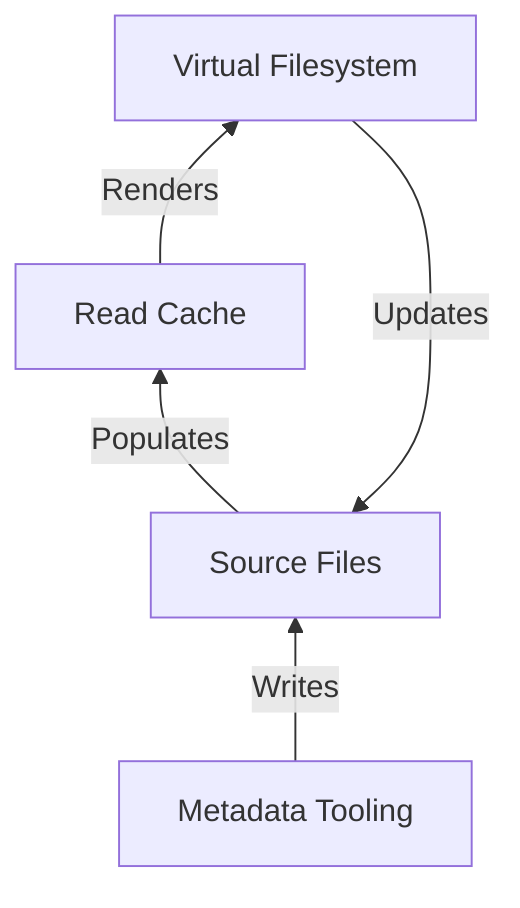

# Rosé

_Work in Progress. See [Issue #1](https://github.com/azuline/rose/issues/1) for
the current state._

A virtual filesystem for music and metadata improvement tooling.

## The Virtual Filesystem

Rosé reads a source directory of albums like this:

```tree
.
├── BLACKPINK - 2016. SQUARE ONE
├── BLACKPINK - 2016. SQUARE TWO
├── LOOΠΔ - 2019. [X X]
├── LOOΠΔ - 2020. [#]
├── LOOΠΔ 1_3 - 2017. Love & Evil
├── LOOΠΔ ODD EYE CIRCLE - 2017. Max & Match
└── YUZION - 2019. Young Trapper
```

And constructs a virtual filesystem from the source directory's audio tags. The
virtual filesystem enables viewing various subcollections of the source
directory based on multiple types of tags as a filesystem.

While music players and music servers enable viewing releases with similar
filters, those filters are only available in a proprietary UI. Rosé provides
this filtering as a filesystem, which is easily composable with other tools and
systems.

The virtual filesystem constructed from the above source directory is:

```tree
.
├── Albums
│   ├── BLACKPINK - 2016. SQUARE ONE - Single [K-Pop] {YG Entertainment}
│   ├── BLACKPINK - 2016. SQUARE TWO - Single [K-Pop] {YG Entertainment}
│   ├── LOOΠΔ 1_3 - 2017. Love & Evil [K-Pop] {BlockBerry Creative}
│   ├── LOOΠΔ - 2019. [X X] [K-Pop] {BlockBerry Creative}
│   ├── LOOΠΔ - 2020. [#] [K-Pop] {BlockBerry Creative}
│   ├── LOOΠΔ ODD EYE CIRCLE - 2017. Max & Match [K-Pop] {BlockBerry Creative}
│   └── YUZION - 2019. Young Trapper [Hip Hop] {No Label}
├── Artists
│   ├── BLACKPINK
│   │   ├── BLACKPINK - 2016. SQUARE ONE - Single [K-Pop] {YG Entertainment}
│   │   └── BLACKPINK - 2016. SQUARE TWO - Single [K-Pop] {YG Entertainment}
│   ├── LOOΠΔ
│   │   ├── LOOΠΔ - 2019. [X X] [K-Pop] {BlockBerry Creative}
│   │   └── LOOΠΔ - 2020. [#] [K-Pop] {BlockBerry Creative}
│   ├── LOOΠΔ 1_3
│   │   └── LOOΠΔ 1_3 - 2017. Love & Evil [K-Pop] {BlockBerry Creative}
│   ├── LOOΠΔ ODD EYE CIRCLE
│   │   └── LOOΠΔ ODD EYE CIRCLE - 2017. Max & Match [K-Pop] {BlockBerry Creative}
│   └── YUZION
│       └── YUZION - 2019. Young Trapper [Hip Hop] {No Label}
├── Genres
│   ├── Hip-Hop
│   │   └── YUZION - 2019. Young Trapper [Hip Hop] {No Label}
│   └── K-Pop
│       ├── BLACKPINK - 2016. SQUARE ONE - Single [K-Pop] {YG Entertainment}
│       ├── BLACKPINK - 2016. SQUARE TWO - Single [K-Pop] {YG Entertainment}
│       ├── LOOΠΔ 1_3 - 2017. Love & Evil [K-Pop] {BlockBerry Creative}
│       ├── LOOΠΔ - 2019. [X X] [K-Pop] {BlockBerry Creative}
│       ├── LOOΠΔ - 2020. [#] [K-Pop] {BlockBerry Creative}
│       └── LOOΠΔ ODD EYE CIRCLE - 2017. Max & Match [K-Pop] {BlockBerry Creative}
└── Labels
    ├── BlockBerry Creative
    │   ├── LOOΠΔ 1_3 - 2017. Love & Evil [K-Pop] {BlockBerry Creative}
    │   ├── LOOΠΔ - 2019. [X X] [K-Pop] {BlockBerry Creative}
    │   ├── LOOΠΔ - 2021. [&] [K-Pop] {BlockBerry Creative}
    │   └── LOOΠΔ ODD EYE CIRCLE - 2017. Max & Match [K-Pop] {BlockBerry Creative}
    ├── No Label
    │   └── YUZION - 2019. Young Trapper [Hip Hop] {No Label}
    └── YG Entertainment
        ├── BLACKPINK - 2016. SQUARE ONE - Single [K-Pop] {YG Entertainment}
        └── BLACKPINK - 2016. SQUARE TWO - Single [K-Pop] {YG Entertainment}
```

## The Metadata Improvement Tooling

Rosé constructs the virtual filesystem from the audio tags. However, audio tags
are frequently missing or incorrect. Thus, Rosé also provides a set of tools to
improve the audio tag metadata.

Note that the metadata manager _modifies_ the source files. If you do not want
to modify the source files, you should `chmod 444` and not use the metadata
manager!

I have yet to write this part of the tool. Please check back later!

# Installation

Install with Nix Flakes:

```bash
$ nix profile install github:azuline/rose#rose
```

You can install Nix and Nix Flakes with
[this installer](https://github.com/DeterminateSystems/nix-installer).

# Usage

```
Usage: rose [OPTIONS] COMMAND [ARGS]...

  A virtual filesystem for music and metadata improvement tooling.

Options:
  -v, --verbose      Emit verbose logging.
  -c, --config PATH  Override the config file location.
  --help             Show this message and exit.

Commands:
  cache  Manage the read cache.
  fs     Manage the virtual library.
  print  Print cached library data (JSON-encoded).
```

## Configuration

Rosé must be configured prior to use. Rosé is configured via a TOML file
located at `${XDG_CONFIG_HOME:-$HOME/.config}/rose/config.toml`.

The configuration parameters, with examples, are:

```toml
# The directory containing the music to manage.
music_source_dir = "~/.music-source"
# The directory to mount the library's virtual filesystem on.
fuse_mount_dir = "~/music"
# The directory to write the cache to. Defaults to
# `${XDG_CACHE_HOME:-$HOME/.cache}/rose`.
cache_dir = "~/.cache/rose"
```

The `--config/-c` flag overrides the config location.

## Music Source Dir

The `music_source_dir` must be a flat directory of albums, meaning all albums
must be top-level directories inside `music_source_dir`. Each album should also
be a single directory in `music_source_dir`.

Every directory should follow the format: `$music_source_dir/$album_name/$track.mp3`.
Additional nested directories are not currently supported.

So for example: `$music_source_dir/BLACKPINK - 2016. SQUARE ONE/*.mp3`.

Rosé writes playlist and collage files to the `$music_source_dir/.playlists`
and `$music_source_dir/.collages` directories. Each file is a human-readable
TOML file.

## Supported Filetypes

Rosé supports `.mp3`, `.m4a`, `.ogg` (vorbis), `.opus`, and `.flac` audio files.

Rosé also supports JPEG and PNG cover art. The supported cover art file stems
are `cover`, `folder`, and `art`. The supported cover art file extensions are
`.jpg`, `.jpeg`, and `.png`.

## Virtual Filesystem

The virtual filesystem is mounted and unmounted by `rose fs mount` and
`rose fs unmount` respectively.

TODO

## Metadata Management

TODO

## Data Querying

The `rose print` family of commands (e.g. `rose print albums`) prints out data
in the read cache in a JSON-encoded format. The output of this command can be
piped into tools like `jq`, `fx`, and others in order to further process the
output.

## Tagging Conventions

Rosé is lenient in the tags it ingests, but has opinionated conventions for the
tags it writes.

### Multi-Valued Tags

Rosé supports multiple values for the artists, genres, and labels tags. Rosé
uses the `;` character as a tag delimiter. For example, `genre=Deep House;Techno`.

Rosé also preserves the artists' role in the artist tag by using specialized
delimiters. for example, `artist=Pyotr Ilyich Tchaikovsky performed by André Previn;London Symphony Orchestra feat. Barack Obama`.

The artist tag is described by the following grammar:

```
artist-tag ::= composer dj main guest remixer
composer   ::= name ' performed by '
dj         ::= name ' pres. '
main       ::= name
guest      ::= ' feat. ' name
remixer    ::= ' remixed by ' name
name       ::= string ';' name | string
```

## New Releases

TODO

## Bookmarks

TODO

## The Read Cache

For performance, Rosé processes every audio file in the `music_source_dir` and
records all metadata in a SQLite read cache. This read cache does not accept
writes, meaning it can always be fully recreated from the source audio files.

The cache can be updated with the command `rose cache update`. By default, the
cache updater will only recheck files that have changed since the last run. To
override this behavior and always re-read file tags, run `rose cache update --force`.

By default, the cache is updated on `mount` and on changes made through the
virtual filesystem. However, changes made directly to the `music_source_dir`
will not trigger a cache update. This can lead to cache drift.

You can solve this by running `rose cache watch`. This starts a background
watcher that listens to inotify and reactively updates the cache whenever a
source file changes. This can be useful if you synchronize your music library
between two computers, or use an external tool to directly modify the source
files (instead of modifying through the virtual filesystem).

## Systemd Unit Files

TODO; example unit files to schedule Rosé with systemd.

## Logging

Logs are written to stderr and to `${XDG_STATE_HOME:-$HOME/.local/state}/rose/rose.log`.

# Architecture

Rosé has a simple uni-directional looping architecture.

1. The source files: audio+playlists+collages, are the single source of truth.
2. The read cache is transient and deterministically derived from source
   files. It can always be deleted and fully recreated from source files.
3. The virtual filesystem uses the read cache (for performance). Writes to the
   virtual filesystem update the source files and then refresh the read cache.
4. The metadata manager writes to the source files directly, which in turn
   refreshes the read cache.



This architecture takes care to ensure that there is a single source of truth
and uni-directional mutations. This has a few benefits:

- Rosé and the source files always have the same metadata. If they drift, `rose
  cache update` will rebuild the cache such that it fully matches the source
  files. And if the watchdog is running, there should not be any drift.
- Rosé is easily synchronized across machines. As long as the source
  files are synchronized, Rosé will rebuild the exact same cache regardless of
  machine.

Rosé writes `.rose.{uuid}.toml` files into each album's directory as a way to
preserve release-level state and keep release UUIDs consistent across full
cache rebuilds.

Tracks are uniquely identified by the `(release_uuid, discnumber, tracknumber)`
tuple, which are also consistent across rebuilds.
