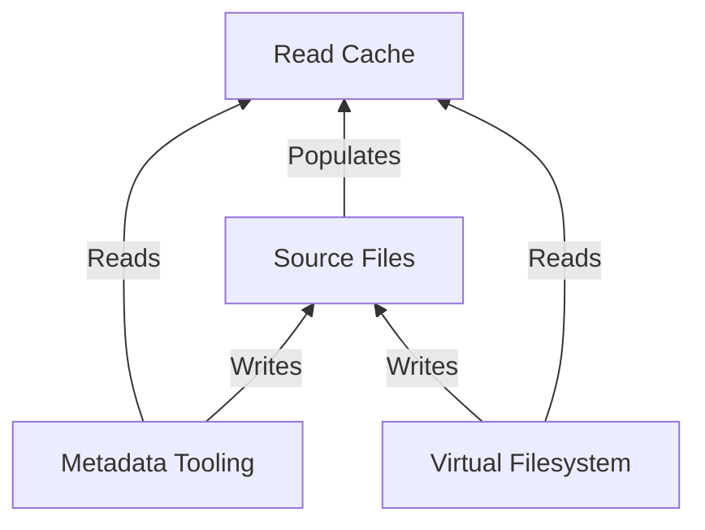

# Architecture

Rosé has a simple uni-directional looping architecture.

1. The source audio files, playlist files, and collage files are single sources of truth. All writes
   are made directly to the sources files.
2. The read cache is transient and deterministically derived from source files. It can always be
   deleted and fully recreated from source files. It updates in response to changes in the source
   files.
3. The virtual filesystem uses the read cache for performance. All writes made via the virtual
   filesystem are made to the Source Files, which in turn refreshes the read cache.
4. The metadata tooling uses the read cache for performance, but always writes to the source files
   directly, which in turn refreshes the read cache.

This architecture takes care to ensure that there is a single source of truth and uni-directional
mutations. This means that Rosé and the source files always have the same metadata. If the source
files change, `rose cache update` is guaranteed to rebuild the cache such that it fully matches the
source files. And if `rose cache watch` is running, the cache updates should happen automatically.

This has some nice consequences:

- External tag editing tools do not conflict with Rosé. If an external tool modifies the audio tags,
  Rosé will not overwrite those changes.
- Rosé is easily synchronized across machines, for example with a tool like Syncthing. As long as
  the source files are in-sync, Rosé's read cache will match.
- Rosé has no ambiguous conflict resolution between audio tags and its own state, because the audio
  tags _are_ the state. Regardless of how the cache drifts from source files, that drift can always
  be automatically resolved simply by rebuilding the cache.

# Release & Track Identifiers

Rosé assigns a stable UUID to each release and track in order to identify them. The UUIDs are also
used to track membership in collages and playlists.

These UUIDs are persisted to the source files:

- Each release has a `.rose.{uuid}.toml` file, which preserves release-level state, such as `New`.
  The UUID is in the filename instead of the file contents for improved performance: we can collect
  the UUID via a `readdir` call instead of an expensive file read. The release UUID is also written
  to the nonstandard `rosereleaseid` audio tag for increased robustness to partial data loss and
  race conditions.
- Each track has a nonstandard `roseid` audio tag that contains the track UUID. This tag is written
  to the source audio file.

Therefore, provided that other programs do not erase the UUID, Rosé will be able to identify
releases and tracks across arbitrarily drastic directory and file renames and tag changes. Rosé does
not depend on the source directory's filenames or tags remaining static; the source directory can be
freely modified. The only constraint is that each release must be a directory in the root of the
`music_source_dir`.

# Virtual Filesystem

We use the `llfuse` library for the virtual filesystem. `llfuse` is a fairly low-level library for
FUSE, which leaves us to work with system-level concepts such as inodes.

Though these concepts have much to do with filesystems, they have little to do with Rosé. Thus, we
have split the Virtual Filesystem code into two main layers:

1. `RoseLogicalCore`: A logical core of Rosé's domain logic, which exposes syscall-like functions at
   a higher semantic level.
2. `VirtualFS`: A wrapper around `RoseLogicalFS` that translates syscalls into Rosé's semantics,
   manages inodes, caches for performance, and "lies" a little so that user tools work
   transparently.

There are a few other useful classes as well. Because the virtual filesystem interface is object
oriented, the entire virtual filesystem module is organized following object orientation principles.
We favor composition over inheritance ^.~

## Ghost Files

Some of Rosé operations break the conventional expectations of a filesystem. Most operations are
still _decent_, but the following two diverge pretty heavily:

1. Adding a release to a collage
2. Adding a track to a playlist

When we add a release to a collage, we take the `mkdir` call and translate that to an
`add_release_to_collage` call. Afterwards, the release is in the collage. And the tracks of the
release magically appear inside the directory afterwards, since that directory is simply the
release.

However, a command like `cp -r` immediately attempts to then replicate files into a supposedly empty
directory, and errors. Strictly speaking, nothing's wrong. Though `cp` errors, the release has been
added to the collage, and the next `ls` command shows that the release has been successfully added
to a collage. But it is quite nice when basic tools work without erroring!

Thus, "Ghost Files." In order to keep tools like `cp` happy, we pretend that files exist (or don't
exist!) for 2-5 seconds after one of the above two operations occur. In the case of collages, the
`VirtualFS` layer pretends that the new directory is empty for 5 seconds, and redirects any incoming
writes into the directory to `/dev/null`.

For playlists, the problem arises in that the copied file vanishes immediately once the file handle
is released. A command like `cp --preserve=mode`, which attempts to replicate file attributes after
releasing the file, fails.

So in the playlists case, we pretend that the written file exists for 2 seconds after we wrote it.
This way, `cp --preserve=mode` can replicate its attributes onto a ghost file and happily exit
without errors.

# Rules Engine

The rules engine has two subsystems: the DSL and the rule executor. In this section, we'll go into
rule executor performance.

The naive implementation has us searching the SQLite database with `LIKE` queries, which is not
performant. Regex is even less so, which is why we do not support regex matchers (but we support
regex actions!).

In Rosé, we instead index all tags into SQLite's Full Text Search (FTS). Every character in a tag is
treated as a word, which grants us substring search, at the expense of a twice-as-large read cache.
Note that this is _not_ the typical way a FTS engine is used: words are typically words, not
individual characters.

However, FTS is not designed to care about ordering, so a search query like `Rose` would match the
substring `esoR`. This "feature" of FTS leads to false positives. So we introduce an additional
fully-accurate Python filtering step on the results of the FTS query. The Python filtering isn't
performant enough to run on all results, but it is sufficiently efficient to run on the subset of
tracks returned from the FTS query.

In the very brief testing period, the FTS implementation was around a hundred times faster than the
naive `LIKE` query. Queries that took multiple seconds with `LIKE` completed in tens of milliseconds
with FTS.

# Read Cache

The read cache fully encapsulates the SQLite database. Other modules do not read directly from the
SQLite database; they use the higher-level read functions from the cache module. (Though we cheap
out on tests, which do test against the database directly.)

The read cache's update procedure is optimized to minimize the number of disk accesses, as it's a
hot path and quite expensive if implemented poorly. The update procedure first pulls all relevant
cached data from SQLite. Stored on each track is the mtime during the previous cache update. The
cache update checks whether any files have changed via `readdir` and `stat` calls, and only reads
the file if the `mtime` has changed. Throughout the update, we take note of the changes to apply. At
the end of the update, we make a few fat SQL queries to batch the writes.

The update procedure is also parallelizable, so we shard workloads across multiple processes when
the number of releases to update is greater than 50.

# Logging

Logs are written to stderr. Logs are also written to disk: to
`${XDG_STATE_HOME:-$HOME/.local/state}/rose/rose.log` on Linux and `~/Library/Logs/rose/rose.log` on
MacOS. Logs are configured to rotate once the log file reaches 20MB. The previous 10 rotations are
kept; all older rotations are deleted.

Debug logging can be turned on with the `--verbose/-v` option. Rosé is heavily instrumented with
debug logging. If you stumble upon a bug that you can reproduce, reproduce it with debug logging
enabled.

In tests, due to our use of multiple processes for testing the virtual filesystem, some logs may not
be displayed by default by pytest. By default, we do not register a logging handler in tests, since
pytest registers its own. However, if you run tests with `LOG_TEST=1`, Rosé will attach its own
logging handler, which will print debug logs from other processes on failure.
