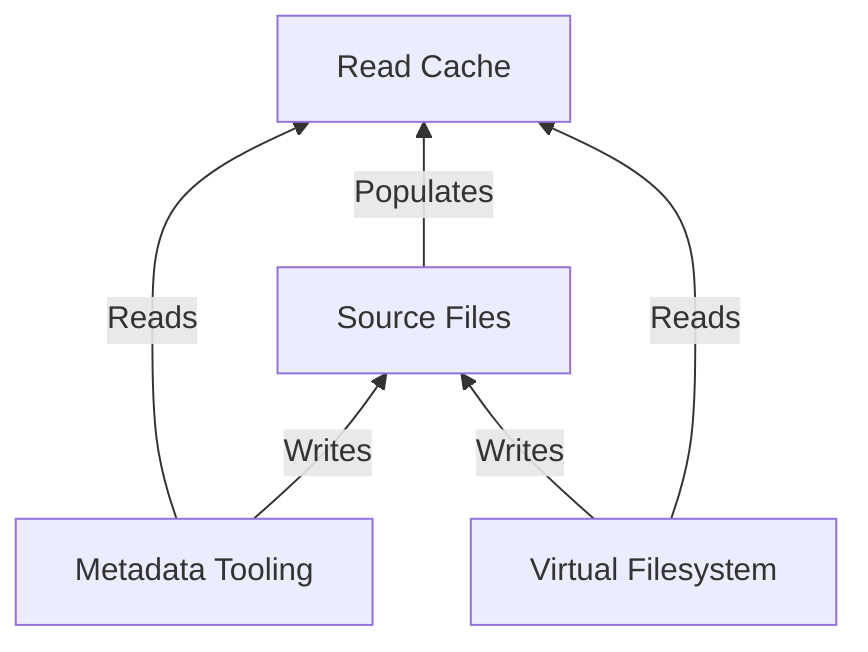

# Architecture

Rosé has a simple uni-directional looping architecture.

1. The source audio files, playlist files, and collage files are single sources
   of truth. All writes are made directly to the sources files.
2. The read cache is transient and deterministically derived from source
   files. It can always be deleted and fully recreated from source files. It
   updates in response to changes in the source files.
3. The virtual filesystem uses the read cache for performance. All writes made
   via the virtual filesystem are made to the Source Files, which in turn
   refreshes the read cache.
4. The metadata tooling uses the read cache for performance, but always writes
   to the source files directly, which in turn refreshes the read cache.

This architecture takes care to ensure that there is a single source of truth
and uni-directional mutations. This means that Rosé and the source files always
have the same metadata. If the source files change, `rose cache update` is
guaranteed to rebuild the cache such that it fully matches the source files.
And if `rose cache watch` is running, the cache updates should happen
automatically.

This has some nice consequences:

- External tag editing tools do not conflict with Rosé. If an external tool
  modifies the audio tags, Rosé will not overwrite those changes.
- Rosé is easily synchronized across machines, for example with a tool like
  Syncthing. As long as the source files are in-sync, Rosé's read cache will
  match.
- Rosé has no ambiguous conflict resolution between audio tags and its own
  state, because the audio tags _are_ the state. Regardless of how the cache
  drifts from source files, that drift can always be automatically resolved
  simply by rebuilding the cache.

# Release & Track Identifiers

Rosé assigns a stable UUID to each release and track in order to identify them.
The UUIDs are also used to track membership in collages and playlists.

These UUIDs are persisted to the source files:

- Each release has a `.rose.{uuid}.toml` file, which preserves release-level
  state, such as `New`. The UUID is in the filename instead of the file
  contents for improved performance: we can collect the UUID via a `readdir`
  call instead of an expensive file read.
- Each track has a custom `roseid` tag. This tag is written to the source audio
  file.

Therefore, provided that other programs do not erase the UUID, Rosé will be
able to identify releases and tracks across arbitrarily drastic directory and
file renames and tag changes. Rosé does not depend on the source directory's
filenames or tags remaining static; the source directory can be freely
modified. The only constraint is that each release must be a directory in the
root of the `music_source_dir`.

# Read Cache Update

The read cache update is optimized to minimize the number of disk accesses, as
it's a hot path and quite expensive if implemented poorly.

The read cache update first pulls all relevant cached data from SQLite. Stored
on each track is the mtime during the previous cache update. The cache update
checks whether any files have changed via `readdir` and `stat` calls, and only
reads the file if the `mtime` has changed. Throughout the update, we take note
of the changes to apply. At the end of the update, we make a few fat SQL
queries to batch the writes.

The update process is also parallelizable, so we shard workloads across
multiple processes.

# Logging

Logs are written to stderr and to `${XDG_STATE_HOME:-$HOME/.local/state}/rose/rose.log`.
Debug logging can be turned on with the `--verbose/-v` option. Rosé is heavily
instrumented with debug logging.
